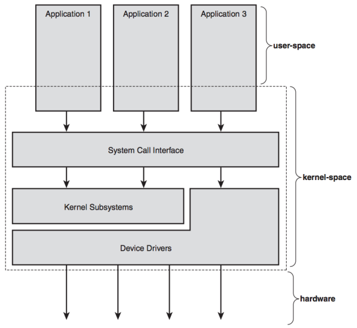
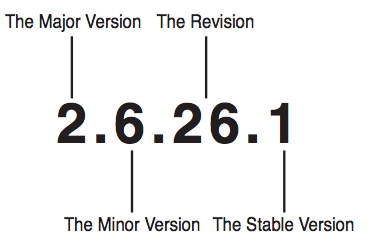

### **Chapter 1. Introduction to the Linux Kernel**

### Overview of Operating Systems and Kernels

The **operating system** is the parts of the system responsible for basic use and administration. This includes the kernel and device drivers, boot loader, command shell or other user interface, and basic file and system utilities.

The **kernel** is the innermost portion of the operating system. It is the core internals: the software that provides basic services for all other parts of the system, manages hardware, and distributes system resource.

Typical components of a kernel are:

* Interrupt handlers to service interrupt requests.
* A scheduler to share processor time among multiple processes.
* A memory management system to manage process address spaces.
* System services such as networking and interprocess communication.

#### Kernel-Space and User-Space *

* **Kernel-space**: on modern systems with protected memory management units, the kernel typically resides in an elevated system state, which includes a protected memory space and full access to the hardware. This system state and memory space is collectively referred to as kernel-space.
* **User-space**: applications execute in user-space, where they can access a subset of the machine’s available resources and can perform certain system functions, directly access hardware, access memory outside of that allotted them by the kernel, or otherwise misbehave.

When executing kernel code, the system is in kernel-space executing in kernel mode. When running a regular process, the system is in user-space executing in user mode.

#### System Calls and Library Calls *

Applications communicate with the kernel via system calls ([Figure 1.1](figure_1.1.png)). An application typically calls functions in a library (e.g. C library) which rely on the system call interface to instruct the kernel to carry out tasks on the application's behalf.

* Some library calls provide many features not found in the system call. Therefore, calling into the kernel is just one step in an otherwise large function. For example, the `printf()` function provides formatting and buffering of the data; only one step in its work is invoking `write()` to write the data to the console.
* Some library calls have a one-to-one relationship with the kernel. For example, the `open()` library function does little except call the `open()` system call.
* Other C library functions, such as `strcpy()`, make no direct use of the kernel at all.

When an application executes a system call, the kernel is executing on behalf of the application. Furthermore, the application is said to be executing a system call in kernel-space, and the kernel is running in process context. This relationship (that applications call into the kernel via the system call interface) is the fundamental manner in which applications get work done.

#### Interrupts

The kernel manages the system’s hardware through **interrupts**. When hardware wants to communicate with the system, it issues an interrupt that interrupts the processor, which in turn interrupts the kernel. A number identifies interrupts and the kernel uses this number to execute a specific **interrupt handler** to process and respond to the interrupt. To provide synchronization, the kernel can disable interrupts (either all interrupts or just one specific interrupt number). In Linux, the interrupt handlers do not run in a process context. Instead, they run in a special interrupt context that is not associated with any process. This special context exists solely to let an interrupt handler quickly respond to an interrupt, and then exit.

In Linux, we can generalize that each processor is doing exactly one of three things at any given moment:

* In user-space, executing user code in a process
* In kernel-space, in process context, executing on behalf of a specific process
* In kernel-space, in interrupt context, not associated with a process, handling an interrupt

### Linux Versus Classic Unix Kernels

Notable differences exist between the Linux kernel and classic Unix systems:

* Linux supports the dynamic loading of kernel modules.Although the Linux kernel is monolithic, it can dynamically load and unload kernel code on demand.
* Linux has symmetrical multiprocessor (SMP) support.
* The Linux kernel is preemptive.
* Linux takes an interesting approach to thread support: It does not differentiate between threads and normal processes.To the kernel, all processes are the same (some just happen to share resources).
* Linux provides an object-oriented device model with device classes, hot-pluggable events, and a user-space device filesystem (sysfs).
* Linux ignores some common Unix features that the kernel developers consider poorly designed, such as STREAMS, or standards that are impossible to cleanly implement.
* Linux is free in every sense of the word

### Linux Kernel Versions

Linux kernels come in two flavors: stable and development.

### The Linux Kernel Development Community

The main forum for this community is the Linux Kernel Mailing List (oft-shortened to *lkml*). Subscription information is available at [http://vger.kernel.org](http://vger.kernel.org).

