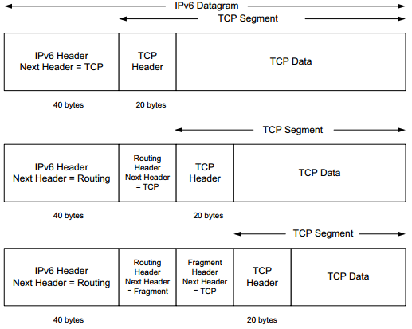
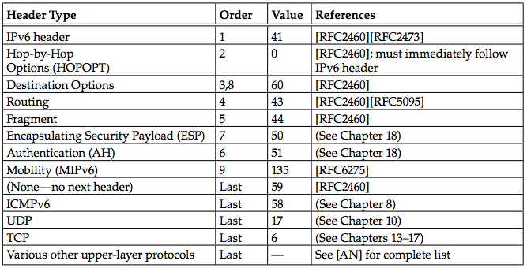

### **Chapter 5. The Internet Protocol (IP)**

> IP is the workhorse protocol of the TCP/IP protocol suite.
> <small>*TCPv1*</small>

### Introduction

IP provides a best-effort, connectionless datagram delivery service. When something goes wrong, such as a router temporarily running out of buffers, IP simly throws away some data. Any required reliability must be provided by the upper layers (e.g. TCP). IPv4 and IPv6 both use this basic best-effort delivery model.

The term *connectionless* means that IP does not maintain any connection state information about related datagrams within the network elements (within the routers):

* Each IP datagram is handled independently from all other others.
* Datagrams can be delivered out of order.

This chapter is on IPv4 and IPv6 header fields, and describes how IP forwarding works.

### IPv4 and IPv6 Headers

##### **IPv4 Header** *

[](figure_5-1.png "The IPv4 datagram. The header is of variable size, limited to fifteen 32-bit words (60 bytes) by the 4-bit IHL field. A typical IPv4 header contains 20 bytes (no options). The source and destination addresses are 32 bits long. Most of the second 32-bit word is used for the IPv4 fragmentation function. A header checksum helps ensure that the fields in the header are delivered correctly to the proper destination but does not protect the data.")

##### **IPv6 Header** *

[](figure_5-2.png "The IPv6 header is of fixed size (40 bytes) and contains 128-bit source and destination addresses. The Next Header field is used to indicate the presence and types of additional extension headers that follow the IPv6 header, forming a daisy chain of headers that may include special extensions or processing directives. Application data follows the header chain, usually immediately following a transport-layer header.")

##### **Size and network byte order** *

* The normal size of the IPv4 header is 20 bytes, unless options are present (which is rare).
* <u>The IPv6 header is twice as large as the IPv4 Header but never has any options.</u> It may have *extension headers*.

In our pictures of headers and datagrams, for a 32-bit value, <u>the most significant bit is numbered 0 at the left, and the least significant bit of a 32-bit value is numbered 31 on the right.</u> The 4 bytes in a 32-bit value are transmitted in the following order: bits 0–7 first, then bits 8–15, then 16–23, and bits 24–31 last. This is called **big endian** byte ordering, which is the byte ordering required for all binary integers in the TCP/IP headers as they traverse a network. It is also called **network byte order**. Computer CPUs that store binary integers in little endian format must convert the header values into network byte order for transmission and back again for reception.

#### IP Header Fields

* The **Version** field is the first field (only 4 bits or one nibble wide). It contains the version number of the IP datagram: 4 for IPv4 and 6 for IPv6.
    * This is the only field that IPv4 and IPv6 of which share the location. The two protocols are not directly interoperable, which means a host or router must handle either IPv4 or IPv6 (or both, called **dual stack**) separately.
* The **Internet Header Length (IHL)** field is the number of 32-bit words in the IPv4 header, including any options.
    * Because this is also a 4-bit field, the IPv4 header is limited to a maximum of fifteen 32-bit words or 60 bytes.
    * The normal value of this field (when no options are present) is 5. There is no such field in IPv6 because the header length is fixed at 40 bytes.
* The 8 bits following the header length (IPv4) are two fields used for special processing of the datagram when it is forwarded, in both IPv4 and IPv6:
    * The first 6 bits are the **Differentiated Services (DS)** field.
    * The last 2 bits are the **Explicit Congestion Notification (ECN)** field or indicator bits.
* The **Total Length** field is the total length of the IPv4 datagram in bytes.
    * Using this field and the IHL field can indicate where the data portion of the datagram starts, and its length.
    * Because this is a 16-bit field, the maximum size of an IPv4 datagram (including header) is 65,535 bytes.
    * This field is required in the header because some lower-layer protocols that carry IPv4 datagrams do not (accurately) convey the size of encapsulated datagrams on their own. For example, Ethernet pads small frames to be a minimum length (64 bytes) and an IPv4 datagram (minimum 20 bytes) can be smaller than the minimum Ethernet payload size (46 bytes). Without the Total Length field, the IPv4 implementation would not know how much of a 46-byte Ethernet frame was really an IP datagram, as opposed to padding.
    * Although it is possible to send a 65,535-byte IP datagram, most link layers (such as Ethernet) are not able to carry one this large without fragmenting it into smaller pieces.
        * <u>In IPv4, a host is not required to be able to receive an IPv4 datagram larger than 576 bytes.</u>
        * <u>In IPv6 a host must be able to process a datagram at least as large as the MTU of the link to which it is attached, and the minimum link MTU is 1280 bytes.</u>

        Many applications that use the UDP protocol ([Chapter 10](ch10.md)) for data transport (e.g., DNS, DHCP, etc.) use a limited data size of 512 bytes to avoid the 576-byte IPv4 limit. TCP chooses its own datagram size based on additional information ([Chapter 15](ch15.md)).

    * When an IPv4 datagram is fragmented into multiple smaller fragments, each of which itself is an independent IP datagram, the Total Length field reflects the length of the particular fragment.

* The **Payload Length** field is the length of the IPv6 datagram not including the length of the header; extension headers, however, are included in the Payload Length field. In IPv6, fragmentation is not supported by the header.
    * The 16-bit size of this field limits its maximum value to 65,535 (64KB), which applies to the payload length, not the entire datagram.
    * In addition, IPv6 supports a **jumbogram** option that provides for the possibility (at least theoretically) of single packets with payloads as large as 4GB (4,294,967,295 bytes).
* The **Identification** field (IPv4) indentifies each datagram sent by an IPv4 host. To prevent confusion among fragments of a datagrams, the sending host normally increments an internal counter by 1 each time a datagram is sent (from one of its IP addresses) and copies the value of the counter into the IPv4 Identification field.
    * This field is most important for implementing fragmentation, along with the Flags and Fragment Offset fields.
    * In IPv6, this field shows up in the Fragmentation extension header,
* The **Time-to-Live** field, or **TTL**, sets an upper limit on the number of routers through which a datagram can pass.
    * This field initialized by the sender to some value (64 is recommended, although 128 or 255 is not uncommon) and decremented by 1 by every router that forwards the datagram. <u>When this field reaches 0, the datagram is thrown away, and the sender is notified with an ICMP message</u> ([Chapter 8](ch8.md)). This prevents packets from getting caught in the network forever should an unwanted routing loop occur.
    * In IPv6, the field has been renamed to its de facto use: **Hop Limit**.
* The **Protocol** field in the IPv4 header contains a number indicating the type of data found in the payload portion of the datagram. The most common values are 17 (for UDP) and 6 (for TCP).
    * This field provides a demultiplexing feature so that the IP protocol can be used to carry payloads of more than one protocol type. Although this field originally specified the transport-layer protocol the datagram is encapsulating, it now can identify the encapsulated protocol, which may or not be a transport protocol. Other encapsulations are possible, such as IPv4-in-IPv4 (value 4). The official list of the possible values of the Protocol field
is given in the [assigned numbers page](http://www.iana.org/assignments/protocol-numbers/protocol-numbers.xhtml).
* The **Next Header** field in the IPv6 header generalizes the Protocol field from IPv4. It is used to indicate the type of header following the IPv6 header. This field may contain any values defined for the IPv4 Protocol field, or any of the values associated with the IPv6 extension headers.
* The **Header Checksum** field is calculated *over the IPv4 header only*, which means that <u>the payload of the IPv4 datagram (e.g., TCP or UDP data) is not checked for correctness by the IP protocol.</u> To ensure the payload has been correctly delivered, other protocols must cover any important data that follows the header with their own data-integrity-checking mechanisms.
    * Almost all protocols encapsulated in IP (ICMP, IGMP, UDP, and TCP) have a checksum in their own headers to cover their header and data and also to cover certain parts of the IP header they deem important (a form of "layering violation").
    * The IPv6 header does not have any checksum field.
    * The algorithm used in computing a checksum (also used by most of the other Internet-related protocols) is sometimes known as the **Internet checksum**.
    * When an IPv4 datagram passes through a router, its header checksum must change as a result of decrementing the TTL field.
* The **Source IP Address** is the IP address of the datagram's sender and the **Destination IP Address** of where the datagram is destined. These are 32-bit values for IPv4 and 128-bit values for IPv6, and they usually identify a single interface on a computer, although multicast and broadcast addresses ([Chapter 2](ch2.md)) violate this rule.

#### The Internet Checksum

The **Internet checksum** is a 16-bit mathematical sum used to determine, with reasonably high probability, whether a received message or portion of a message matches the one sent. the Internet checksum algorithm is not the same as the common **cyclic redundancy check** (CRC), which offers stronger protection.

To compute the IPv4 header checksum for an outgoing datagram, the value of the datagram’s Checksum field is first set to 0. Then, the 16-bit one’s complement sum of the header is calculated (the entire header is considered a sequence of 16-bit words). The 16-bit one’s complement of this sum is then stored in the Checksum field to make the datagram ready for transmission.

When an IPv4 datagram is received, a checksum is computed across the whole header, including the value of the Checksum field itself. Assuming there are no errors, the computed checksum value is always 0 (a one’s complement of the value FFFF). <u>The value of the Checksum field in the packet can never be FFFF.</u> If it were, the sum (prior to the final one’s complement operation at the sender) would have to have been 0. No sum can ever be 0 using one’s complement addition unless all the bytes are 0. ([end-round carry](https://en.wikipedia.org/wiki/Signed_number_representations#Ones.27_complement))

When the header is found to be bad (the computed checksum is nonzero), the IPv4 implementation discards the received datagram. No error message is generated. It is up to the higher layers to somehow detect the missing datagram and retransmit if necessary.

##### **Mathematics of the Internet Checksum**

For the mathematically inclined, the set of 16-bit hexadecimal values V = {0001, . . . , FFFF} and the one’s complement sum operation + together form an [Abelian group](https://en.wikipedia.org/wiki/Abelian_group). The following properties are obeyed:

* For any X,Y in V, (X + Y) is in V [closure]
* For any X,Y,Z in V, X + (Y + Z) = (X + Y) + Z [associativity]
* For any X in V, e + X = X + e = X where e = FFFF [identity]
* For any X in V, there is an X′ in V such that X + X′ = e [inverse]
* For any X,Y in V, (X + Y) = (Y + X) [commutativity]

Note that in the set V and the group &lt;V,+&gt;, number 0000 deleted the from consideration. If we put the number 0000 in the set V, then &lt;V,+&gt; is not a group any longer. [p187-188]

#### DS Field and ECN

The third and fourth fields of the IPv4 header (second and third fields of the IPv6 header) are the **Differentiated Services** (called DS Field) and **ECN** fields, formerly called the **ToS Byte** or IPv6 **Traffic Class**.

Differentiated Services (called *DiffServ*) is a framework and set of standards aimed at supporting differentiated classes of service (beyond just best-effort) on the Internet. IP datagrams that are marked in certain ways may be forwarded differently (e.g., with higher priority) and can lead to increased or decreased queuing delay in the network and other special effects (possibly with associated special fees imposed by an ISP). [p188]

The Differentiated Services Code Point (DSCP) is a number (in the DS Field) that refers to a particular predefined arrangement of bits with agreed-upon meaning. Datagrams have a DSCP assigned to them when they are given to the network infrastructure that remains unmodified during delivery ,but policies (such as how many high-priority packets are allowed to be sent in a period of time) may cause a change in DSCP during delivery. [p188]

The pair of ECN bits marks a datagram with a *congestion indicator* when passing through a router that has a significant amount of internally queued traffic. Both bits are set by persistently congested ECN-aware routers when forwarding packets. When a marked packet is received at the destination, some protocol (such as TCP) will notice that the packet is marked and indicate this fact back to the sender, which would then slow down, thereby easing congestion before a router is forced to drop traffic because of overload. This mechanism is one of several aimed at avoiding or dealing with network congestion.

(Original uses for the ToS and Traffic Class skipped) [p188-189]

The 6-bit DS Field holds the DSCP, providing support for 64 distinct code points. The particular value of the DSCP, expressed as **per-hop behavior** (PHB), tells a router the forwarding treatment or special handling the datagram should receive. The default value for the DSCP is generally 0, which corresponds to routine, best-effort Internet traffic.

[![The DS Field contains the DSCP in 6 bits (5 bits are currently standardized to indicate the forwarding treatment the datagram should receive when forwarded by a compliant router). The following 2 bits are used for ECN and may be turned on in the datagram when it passes through a persistently congested router. When such datagrams arrive at their destinations, the congestion indication is sent back to the source in a later datagram to inform the source that its datagrams are passing through one or more congested routers.](figure_5-5.png)](figure_5-5.png "The DS Field contains the DSCP in 6 bits (5 bits are currently standardized to indicate the forwarding treatment the datagram should receive when forwarded by a compliant router). The following 2 bits are used for ECN and may be turned on in the datagram when it passes through a persistently congested router. When such datagrams arrive at their destinations, the congestion indication is sent back to the source in a later datagram to inform the source that its datagrams are passing through one or more congested routers.")

As indicated in the table below, the DSCP values are divided into three pools: standardized, experimental/local use (EXP/LU), and experimental/local use.

Pool | Code Point Prefix | Policy
---- | ----------------- | ------
1 | xxxxx0 | Standards
2 | xxxx11 | EXP/LU
3 | xxxx01 | EXP/LU(*)

A router is to first segregate traffic into different classes. Traffic within a common class may have different drop probabilities, allowing the router to decide what traffic to drop first if it is forced to discard traffic.

* The 3-bit class selector provides for eight defined code points (called the **class selector code points**) that correspond to PHBs with a specified minimum set of features providing similar functionality to the earlier IP precedence capability. These are called **class selector compliant PHBs**. Code points of the form xxx000 always map to such PHBs.
* The **Assured Forwarding** (AF) group provides forwarding of IP packets in a fixed number of independent AF classes. Traffic from one class is forwarded separately from other classes. Within a traffic class, a datagram is assigned a **drop precedence**. Datagrams of higher drop precedence in a class areare discarded with higher priority over those with lower drop precedence in the same class. Combining the traffic class and drop precedence, the name *AFij* corresponds to assured forwarding class *i* with drop precedence *j*.
* The **Expedited Forwarding** (EF) service provides the appearance of an uncongested network (EF traffic should receive relatively low delay, jitter, and loss). This requires the rate of EF traffic going out of a router to be at least as large as the rate coming in. Consequently, EF traffic will only ever have to wait in a router queue behind other EF traffic.

The following table indicates the class selector DSCP values:

<small>

Name | Value | Reference | Description
---- | ----- | --------- | -----------
CS0 | 000000 | [RFC2474] | Class selector (best-effort/routine)
CS1 | 001000 | [RFC2474] | Class selector (priority)
CS2 | 010000 | [RFC2474] | Class selector (immediate)
CS3 | 011000 | [RFC2474] | Class selector (flash)
CS4 | 100000 | [RFC2474] | Class selector (flash override)
CS5 | 101000 | [RFC2474] | Class selector (CRITIC/ECP)
CS6 | 110000 | [RFC2474] | Class selector (internetwork control)
CS7 | 111000 | [RFC2474] | Class selector (control)
AF11 | 001010 | [RFC2597] | Assured Forwarding (class 1,dp 1)
AF12 | 001100 | [RFC2597] | Assured Forwarding (1,2)
AF13 | 001110 | [RFC2597] | Assured Forwarding (1,3)
AF21 | 010010 | [RFC2597] | Assured Forwarding (2,1)
AF22 | 010100 | [RFC2597] | Assured Forwarding (2,2)
AF23 | 010110 | [RFC2597] | Assured Forwarding (2,3)
AF31 | 011010 | [RFC2597] | Assured Forwarding (3,1)
AF32 | 011100 | [RFC2597] | Assured Forwarding (3,2)
AF33 | 011110 | [RFC2597] | Assured Forwarding (3,3)
AF41 | 100010 | [RFC2597] | Assured Forwarding (4,1)
AF42 | 100100 | [RFC2597] | Assured Forwarding (4,2)
AF43 | 100110 | [RFC2597] | Assured Forwarding (4,3)
EF PHB | 101110 | [RFC3246] | Expedited Forwarding
VOICE-ADMIT | 101100 | [RFC5865] | Capacity-Admitted Traffic

</small>

#### IP Options

IP options may be selected on a per-datagram basis. Many of the options are no longer practical or desirable because of the limited size of the IPv4 header or concerns regarding security. With IPv6, most of the options have been removed or altered and are in the basic IPv6 header but are placed after the IPv6 header in one or more extension headers.

An IP router that receives a datagram containing options should perform special processing. In some cases IPv6 routers process extension headers, but many headers are designed to be processed only by end hosts. In some routers, datagrams with options or extensions are not forwarded as fast as ordinary datagrams.

The table shows most of the IPv4 options that have been standardized over the years.

[](table_5-4.png "Options, if present, are carried in IPv4 packets immediately after the basic IPv4 header. Options are identified by an 8-bit option Type field. This field is subdivided into three subfields: Copy (1 bit), Class (2 bits), and Number (5 bits). Options 0 and 1 are a single byte long, and most others are variable in length. Variable options consist of 1 byte of type identifier, 1 byte of length, and the option itself.")

The options area always ends on a 32-bit boundary. Pad bytes with a value of 0 are added if necessary. This ensures that the IPv4 header is always a multiple of 32 bits (as required by the IHL field). [p192]

Options are identified by an 8-bit option *Type* field. This field is subdivided into three subfields: *Copy* (1 bit), *Class* (2 bits), and *Number* (5 bits). Options 0 and 1 are a single byte long, and most others are variable in length. Variable options consist of 1 byte of type identifier, 1 byte of length, and the option itself.

Most of the standardized options are rarely or never used in the Internet today. In addition, the options are primarily for diagnostic purposes and make the construction of firewalls more cumbersome and risky. Thus, IPv4 options are typically disallowed or stripped at the perimeter of enterprise networks by firewalls. ([Chapter 7](ch7.m))

Within enterprise networks, where the average path length is smaller and protection from malicious users may be less of a concern, options can still be useful. In addition, since the **Router Alert** option is designed primarily as a performance optimization and does not change fundamental router behavior, it is permitted more often than the other options. Some router implementations have a highly optimized internal pathway for forwarding IP traffic containing no options. The Router Alert option informs routers that a packet requires processing beyond the conventional forwarding algorithms. The experimental **Quick-Start** option at the end of the table is applicable to both IPv4 and IPv6.

### IPv6 Extension Headers

In IPv6, special functions such as those provided by options in IPv4 can be enabled by adding extension headers that follow the IPv6 header. IPv6 header is fixed at 40 bytes, and extension headers are added only when needed. [p194]

In choosing the IPv6 header to be of a fixed size, and requiring that extension headers be processed only by end hosts (with one exception), design and construction of high-performance routers are easier because the demands on packet processing at routers can be simpler than with IPv4.

Extension headers, along with headers of higher-layer protocols such as TCP or UDP, are chained together with the IPv6 header to form a cascade of headers (see the figure below). The **Next Header** field in each header indicates the type of the subsequent header, which could be an IPv6 extension header or some other type.  The value of 59 indicates the end of the header chain. The most possible values for the Next Header field are provided in the following table.

[](figure_5-6.png "IPv6 headers form a chain using the Next Header field. Headers in the chain may be IPv6 extension headers or transport headers. The IPv6 header appears at the beginning of the datagram and is always 40 bytes long.")

This figure shows IPv6 headers form a chain using the Next Header field. Headers in the chain may be IPv6 extension headers or transport headers. The IPv6 header appears at the beginning of the datagram and is always 40 bytes long.

[](table_5-5.png "The values for the IPv6 Next Header field may indicate extensions or headers for other protocols. The same values are used with the IPv4 Protocol field, where appropriate.")

This table show values for the IPv6 Next Header field may indicate extensions or headers for other protocols. The same values are used with the IPv4 Protocol field, where appropriate. The IPv6 extension header mechanism distinguishes some functions (e.g., routing and fragmentation) from options.

* The order of the extension headers is given as a recommendation, except for the location of the **Hop-by-Hop Options** (HOPOPT)), which is mandatory, so an IPv6 implementation must be prepared to process extension headers in the order in which they are received.
* Only the **Destination Options** header can be used twice: the first time for options pertaining to the destination IPv6 address contained in the IPv6 header and the second time (position 8) for options pertaining to the final destination of the datagram.
* In some cases (e.g., when the [Routing header](#routing-header) is used), the **Destination IP Address** field in the IPv6 header changes as the datagram is forwarded to its ultimate destination.

#### IPv6 Options

IPv6 options, if present, are grouped into either of the following:

* **Hop-by-Hop Options**: relevant to every router along a datagram’s path
* **Destination Options**: relevant only to the recipient

Hopby-Hop Options (called HOPOPTs) are the only ones that need to be processed by every router a packet encounters.  The format for encoding options within the Hop-by-Hop and Destination Options extension headers is common.

The Hop-by-Hop and Destination Options headers are capable of holding more than one option. Each of these options is encoded as **type-length-value** (TLV) sets, as shown below:

[](figure_5-7.png "Hop-by-hop and Destination Options are encoded as TLV sets. The first byte gives the option type, including subfields indicating how an IPv6 node should behave if the option is not recognized, and whether the option data might change as the datagram is forwarded. The Opt Data Len field gives the size of the option data in bytes.")

In the TLV sets, the first byte gives the option type, including subfields indicating how an IPv6 node should behave if the option is not recognized, and whether the option data might change as the datagram is forwarded. The **Opt Data Len** field gives the size of the option data in bytes.

The 2 high-order bits in an IPv6 TLV option type indicate whether an IPv6 node should forward or drop the datagram if the option is not recognized, and whether a message indicating the datagram’s fate should be sent back to the sender, as shown in the table below:

[](table_5-6.png "The 2 high-order bits in an IPv6 TLV option type indicate whether an IPv6 node should forward or drop the datagram if the option is not recognized, and whether a message indicating the datagram’s fate should be sent back to the sender.")

Options in IPv6 are carried in either Hop-by-Hop (H) or Destination (D) Options extension headers. The option Type field contains the value from the "Type" column with the Action and Change subfields denoted in binary. The "Length" column contains the value of the Opt Data Len byte. See the table below:

[](table_5-7.png "Options in IPv6 are carried in either Hop-by-Hop (H) or Destination (D) Options extension headers. The option Type field contains the value from the “Type” column with the Action and Change subfields denoted in binary. The “Length” column contains the value of the Opt Data Len byte from Figure 5-7. The Pad1 option is the only one lacking this byte.")

[p196-197]

##### **Pad1 and PadN**

IPv6 options are aligned to 8-byte offsets, so options that are naturally smaller are padded with 0 bytes to round out their lengths to the nearest 8 bytes. [p197]

##### **IPv6 Jumbo Payload**

In some TCP/IP networks, such as those used to interconnect supercomputers, the normal 64KB limit on the IP datagram size can lead to unwanted overhead when moving large amounts of data. The IPv6 **Jumbo Payload** option specifies an IPv6 datagram with payload size larger than 65,535 bytes, called a **jumbogram**. This option need not be implemented by nodes attached to links with MTU sizes below 64KB. The Jumbo Payload option provides a 32-bit field for holding the payload size for datagrams with payloads of sizes between 65,535 and 4,294,967,295 bytes (4 GB).

When a jumbogram is formed for transmission, its normal Payload Length field is set to 0. The TCP protocol makes use of the Payload Length field in order to compute its checksum using the Internet checksum algorithm described previously. When the Jumbo Payload option is used, TCP must be careful to use the length value from the option instead of the regular Length field in the base header. [p198]

##### **Tunnel Encapsulation Limit**

[**Tunneling**](https://en.wikipedia.org/wiki/Tunneling_protocol) refers to the encapsulation of one protocol in another that does not conform to traditional layering. For example, IP datagrams may be encapsulated inside the payload portion of another IP datagram.

* Tunneling can be used to form virtual [overlay networks](https://en.wikipedia.org/wiki/Overlay_network), in which one network (e.g., the Internet) acts as a well-connected link layer for another layer of IP.
* Tunnels can be nested in the sense that datagrams that are in a tunnel may themselves be placed in a tunnel, in a recursive fashion.

Using Tunnel Encapsulation Limit option, a sender can specify a limit to have control over how many tunnel levels are ultimately used for encapsulation. Using this option.

##### **Router Alert**

The Router Alert option indicates that the datagram contains information that needs to be processed by a router. It is used for the same purpose as the IPv4 Router Alert option.

##### **Quick-Start**

The Quick-Start (QS) option is used in conjunction with the experimental QuickStart procedure for TCP/IP specified in [RFC4782]. It is applicable to both IPv4 and IPv6 but at present is suggested only for private networks and not the global Internet. [p199]

##### **CALIPSO**

This option is used for supporting the **Common Architecture Label IPv6 Security Option** (CALIPSO) [RFC5570] in certain private networks.

##### **Home Address**

This option holds the "home" address of the IPv6 node sending the datagram when IPv6 mobility options are in use. Mobile IP ([Section 5.5](#mobile-ip)) specifies a set of procedures for handling IP nodes that may change their point of network attachment without losing their higher-layer network connections. [p199]

#### Routing Header

The IPv6 Routing header provides a mechanism for the sender of an IPv6 datagram to control the path the datagram takes through the network. Two different versions of the routing extension header have been specified: type 0 (RH0) and type 2 (RH2):

* RH0 has been deprecated because of security concerns [RFC5095]
* RH2 is defined in conjunction with Mobile IP.

To best understand the Routing header, we begin by discussing RH0 and then investigate why it has been deprecated and how it differs from RH2. RH0 specifies one or more IPv6 nodes to be "visited" as the datagram is forwarded.

[![The now-deprecated Routing header type 0 (RH0) generalizes the IPv4 loose and strict Source Route and Record Route options. It is constructed by the sender to include IPv6 node addresses that act as waypoints when the datagram is forwarded. Each address can be specified as a loose or strict address. A strict address must be reached by a single IPv6 hop, whereas a loose address may contain one or more other hops in between. The IPv6 Destination IP Address field in the base header is modified to contain the next waypoint address as the datagram is forwarded.](figure_5-8_600.png)](figure_5-8.png "The now-deprecated Routing header type 0 (RH0) generalizes the IPv4 loose and strict Source Route and Record Route options. It is constructed by the sender to include IPv6 node addresses that act as waypoints when the datagram is forwarded. Each address can be specified as a loose or strict address. A strict address must be reached by a single IPv6 hop, whereas a loose address may contain one or more other hops in between. The IPv6 Destination IP Address field in the base header is modified to contain the next waypoint address as the datagram is forwarded.")

The IPv6 Routing header shown below generalizes the loose Source and Record Route options from IPv4. RH0 allows the sender to specify a vector of IPv6 addresses for nodes to be visited. [p200-201]

* The header contains an 8-bit **Routing Type** identifier and an 8-bit **Segments Left** field.
    * The Routing Type identifier for IPv6 addresses is 0 for RH0 and 2 for RH2.
    * The Segments Left field indicates how many route segments remain to be processed. (The number of explicitly listed intermediate nodes still to be visited before reaching the final destination.) [p201]

A Routing header is not processed until it reaches the node whose address is contained in the **Destination IP Address** field of the IPv6 header. At this time, the Segments Left field is used to determine the next hop address from the address vector, and this address is swapped with the Destination IP Address field in the IPv6 header. Thus, as the datagram is forwarded, the Segments Left field grows smaller, and the list of addresses in the header reflects the node addresses that forwarded the datagram.

The forwarding procedure is shown in the below figure:

[](figure_5-9.png "Using an IPv6 Routing header (RH0), the sender (S) is able to direct the datagram through the intermediate nodes R2 and R3 . The other nodes traversed are determined by the normal IPv6 routing. Note that the destination address in the IPv6 header is updated at each hop specified in the Routing header.")

1. The sender (S) constructs the datagram with destination address R1 and a Routing header (type 0) containing the addresses R2, R3, and D. The final destination of the datagram is the last address in the list (D). The Segments Left field (labeled "Left") starts at 3.
2. The datagram is forwarded toward R1 automatically by S and R0 . Because R0's address is not present in the datagram, no modifications of the Routing header or addresses are performed by R0 .
3. Upon reaching R1, the destination address from the base header is swapped with the first address listed in the Routing header and the Segments Left field is decremented.
4. As the datagram is forwarded, the process of swapping the destination address with the next address from the address list in the Routing header repeats until the last destination listed in the Routing header is reached.

RH0 has been deprecated by [RFC5095] because of a security concern that allows RH0 to be used to increase the effectiveness of DoS attacks. <u>The problem is that RH0 allows the same address to be specified in multiple locations within the Routing header. This can lead to traffic being forwarded many times between two or more hosts or routers along a particular path.</u> The potentially high traffic loads that can be created along particular paths in the network can cause disruption to other traffic flows competing for bandwidth across the same path. Consequently, RH0 has been deprecated and only RH2 remains as the sole Routing header supported by IPv6. RH2 is equivalent to RH0 except it has room for only a single address and uses a different value in the **Routing Type** field.

#### Fragment Header

The Fragment header is used by an IPv6 source when sending a datagram larger than the path MTU of the datagram’s intended destination. (Path MTU and how it is determined are detailed in [Chapter 13](ch13.md)). 1280 bytes is a network-wide link-layer minimum MTU for IPv6 [RFC2460].

* In IPv4, any host or router can fragment a datagram if it is too large for the MTU on the next hop, and fields within the second 32-bit word of the IPv4 header indicate the fragmentation information.
* In IPv6, only the sender of the datagram is permitted to perform fragmentation, and in such cases a Fragment header is added.

The Fragment header includes the same information as is found in the IPv4 header, but the Identification field is 32 bits instead of the 16 that are used for IPv4. The larger field provides the ability for more fragmented packets to be outstanding in the network simultaneously. The Fragment header uses the format shown in the figure below:

[](figure_5-11.png "The IPv6 Fragment header contains a 32-bit Identification field (twice as large as the Identification field in IPv4). The M bit field indicates whether the fragment is the last of an original datagram. As with IPv4, the Fragment Offset field gives the offset of the payload into the original datagram in 8-byte units.")

* The **Reserved** field and 2-bit Res field are both zero and ignored by receivers.
* The **Fragment Offset** field indicates where the data that follows the Fragment header is located, as a positive offset in 8-byte units, relative to the "fragmentable part" of the original IPv6 datagram.

The datagram serving as input to the fragmentation process is called the "original packet" and consists of two parts: the "unfragmentable part" and the "fragmentable part":

* The **unfragmentable part** includes the IPv6 header and any included extension headers required to be processed by intermediate nodes to the destination, which includes:
    * All headers up to and including the Routing header, or,
    * the Hop-by-Hop Options extension header if only it is present.
* The **fragmentable part** constitutes the remainder of the datagram, which includes:
    * Destination Options header
    * Upper-layer headers
    * Payload data)

When the original packet is fragmented, multiple fragment packets are produced, each of which contains a copy of the unfragmentable part of the original packet followed by the Fragment header. In each fragmented IPv6 packet:

* The IPv6 header has the **Payload Length** field altered to reflect the size of the fragment packet it describes.
* Following the unfragmentable part, each new fragment packet contains a Fragment header with the following fields:
    * An appropriately assigned **Fragment Offset** field (the first fragment contains offset 0)
    * A copy of the original packet’s **Identification** field.
    * The last fragment has its **M** (*More Fragments*) bit field set to 0.

The following example illustrates the way an IPv6 source might fragment a datagram:

[](figure_5-12.png " An example of IPv6 fragmentation where a 3960-byte payload is split into three fragment packets of size 1448 bytes or less. Each fragment contains a Fragment header with the identical Identification field. All but the last fragment have the More Fragments field (M) set to 1. The offset is given in 8-byte units—the last fragment, for example, contains data beginning at offset (362 * 8) = 2896 bytes from the beginning of the original packet’s data. The scheme is similar to fragmentation in IPv4.")

In the figure above, a payload of 3960 bytes is fragmented such that no fragment’s total packet size exceeds 1500 bytes (a typical MTU for Ethernet), yet the <u>fragment data sizes still are arranged to be multiples of 8 bytes.</u> [p204-205]

* A 3960-byte payload is split into three fragment packets of size 1448 bytes or less.
* The Fragment header in each fragment contains a common Identification field
* All but the last fragment have the More Fragments field (M) set to 1. The offset is given in 8-byte units—the last fragment, for example, contains data beginning at offset (362 * 8) = 2896 bytes from the beginning of the original packet’s data. The scheme is similar to fragmentation in IPv4.
* The IPv6 header’s Payload Length field is modified to reflect the size of the data and newly formed Fragment header.

The receiver must ensure that all fragments of an original datagram have been received before performing reassembly. As with fragmentation in IPv4 ([Chapter 10](ch10.md)), fragments may arrive out of order at the receiver but are reassembled in order to form a datagram that is given to other protocols for processing.

[p205-208]

(Wireshark example skipped)

### IP Forwarding

IP forwarding is simple, especially for a host:

* If the destination is directly connected to the host (e.g., a point-to-point link) or on a shared network (e.g., Ethernet), the IP datagram is sent directly to the destination; a router is not required or used.
* Otherwise, the host sends the datagram to a single router (called the *default* router) and lets the router deliver the datagram to its destination.

A host differs from a router in how IP datagrams are handled: a host never forwards datagrams it does not originate, whereas routers do.

The IP protocol can receive a datagram from either of the following:

* Another protocol on the same machine (TCP, UDP, etc.),
* A network interface.

The IP layer has some information in memory, called a **routing table** or **forwarding table**, which it searches each time it receives a datagram to send.

When a datagram is received from a network interface, IP first checks if the destination IP address is one of its own IP addresses (one of the IP addresses associated with one of its network interfaces) or some other address for which it should receive traffic such as an IP broadcast or multicast address:

* If so, the datagram is delivered to the protocol module specified by the **Protocol** field in the IPv4 header or **Next Header** field in the IPv6 header.
* If the datagram is not destined for one of the IP addresses being used locally by the IP module, then:
    * If the IP layer was configured to act as a router, the datagram is forwarded (that is, handled as an outgoing datagram as described in [Section 5.4.2](#ip-forwarding-actions)); or,
    * The datagram is silently discarded. Under some circumstances (e.g., no route is known in case 1), an ICMP message may be sent back to the source indicating an error condition.

#### Forwarding Table

The data in a forwarding table is up to the implementation, though several key pieces of information are generally required to implement the forwarding table for IP. Each entry in the routing or forwarding table contains (at least conceptually) the following information fields:

* **Destination**: This contains a 32-bit field (or 128-bit field for IPv6) used for matching the result of a masking operation. The destination can be:
    * Zero, for a "default route" covering all destinations, or,
    * Full length of an IP address, for a "host route" that describes only a single destination.
* **Mask**: This contains a 32-bit field (or 128-bit field for IPv6) applied as a bitwise AND mask to the destination IP address of a datagram being looked up in the forwarding table. The masked result is compared with the set of destinations in the forwarding table entries.
* **Next-hop**: This contains the 32-bit IPv4 address or 128-bit IPv6 address of the next IP entity (router or host) to which the datagram should be sent. The next-hop entity is typically on a network shared with the system performing the forwarding lookup, meaning the two share the same network prefix.
* **Interface**: This contains an identifier used by the IP layer to reference the network interface that should be used to send the datagram to its next hop. For example, it could refer to a host’s 802.11 wireless interface, a wired Ethernet interface, or a PPP interface associated with a serial port. If the forwarding system is also the sender of the IP datagram, this field is used in selecting which source IP address to use on the outgoing datagram (see [Section 5.6.2.1](the-source-address-selection-algorithm)).

IP forwarding is performed on a *hop-by-hop* basis. The routers and hosts do not contain the complete forwarding path to any destination, except those destinations that are directly connected to the host or router. IP forwarding provides the IP address of only the next-hop entity to which the datagram is sent. The following assumption are made:

* The next hop is really "closer" to the destination than the forwarding system is, and that the next-hop router is directly connected to (shares a common network prefix with) the forwarding system.
* No "loops" are constructed between the next hops so that a datagram does not circulate around the network until its TTL or hop limit expires.

The job of ensuring correctness of the routing table is given to one or more routing protocols. Many different routing protocols are available to do this job, including [RIP](https://en.wikipedia.org/wiki/Routing_Information_Protocol), [OSPF](https://en.wikipedia.org/wiki/Open_Shortest_Path_First), [BGP](https://en.wikipedia.org/wiki/Border_Gateway_Protocol), and [IS-IS](https://en.wikipedia.org/wiki/IS-IS).

#### IP Forwarding Actions

When the IP layer in a host or router needs to send an IP datagram to a next-hop router or host, it first examines the destination IP address (*D*) in the datagram  Using the value *D*, the following **longest prefix match** algorithm is executed on the forwarding table:

1. Search the table for all entries (masking and comparing) for which the following property holds:

    (*D* & *m*<sub>j</sub>) = *d*<sub>j</sub>

    Where:

    * *m*<sub>j</sub> is the value of the mask field associated with the forwarding entry *e*<sub>j</sub> having index j
    * *d*<sub>j</sub> is the value of the destination field associated with *e*<sub>j</sub>.

    This means that the destination IP address *D* is bitwise ANDed with the mask in each forwarding table entry (*m*<sub>j</sub>), and the result is compared against the destination in the same forwarding table entry (*d*<sub>j</sub>). If the property holds, the entry (*e*<sub>j</sub> here) is a "match" for the destination IP address. When a match happens, the algorithm notes the entry index (*j* here) and how many bits in the mask *m*<sub>j</sub> were 1. The more bits are 1, the "better" the match.

2. The best matching entry *e*<sub>k</sub> (the one with the largest number of 1 bits in its mask *m*<sub>j</sub>) is selected, and its next-hop field *nm*<sub>k</sub> is used as the next-hop IP address in forwarding the datagram.

If no matches in the forwarding table are found, the datagram is undeliverable:

* If on a host (the undeliverable datagram was generated locally), a "host unreachable" error is normally returned to the application that generated the datagram.
* If on a router, an ICMP message is normally sent back to the host that sent the datagram.

In some circumstances, more than one entry may match an equal number of 1 bits: for example, when more than one default route is available (e.g., when attached to more than one ISP, called [multihoming](https://en.wikipedia.org/wiki/Multihoming)). A common behavior is for the system to simply choose the first match. More sophisticated systems may attempt to load-balance or split traffic across the multiple routes. Studies suggest that multihoming can be beneficial not only for large enterprises, but also for residential users. [p210]

#### Examples of IP Forwarding

There are two cases of IP forwarding:

* **Direct delivery**: all systems are using the same network prefix.
* **Indirect delivery** ([Figure 5-16](figure_5-16.png)).

##### **Direct Delivery**

Host S (with IPv4 address S and MAC address <u>S</u>) has an IP datagram to send to Host D (IPv4 address D, MAC address <u>D</u>). Both hosts are on the same Ethernet ([front cover](front_cover.jpg)) and are interconnected using a switch. [p210]

The top part of the following figure shows the delivery of the datagram and the forwarding table on S to contain the information as shown in the following table:

[](figure_5-16.png "Direct delivery does not require the presence of a router—IP datagrams are encapsulated in a link-layer frame that directly identifies the source and destination. Indirect delivery involves a router—data is forwarded to the router using the router’s link-layer address as the destination link-layer address. The router’s IP address does not appear in the IP datagram (unless the router itself is the source or destination, or when source routing is used).")

Destination | Mask | Gateway (Next Hop) | Interface
----------- | ---- | ------------------ | ---------
0.0.0.0 | 0.0.0.0 | 10.0.0.1 | 10.0.0.100
10.0.0.0 | 255.255.255.128 | 10.0.0.100 | 10.0.0.100

<small>
The (unicast) IPv4 forwarding table at host S contains only two entries. Host S is configured with IPv4 address and subnet mask 10.0.0.100/25. Datagrams destined for addresses in the range 10.0.0.1 through 10.0.0.126 use the second forwarding table entry and are sent using direct delivery. All other datagrams use the first entry and are given to router R with IPv4 address 10.0.0.1.
</small>

Direct delivery does not require the presence of a router: IP datagrams are encapsulated in a link-layer frame that directly identifies the source and destination. In the above forwarding table, the destination IPv4 address D (10.0.0.9) matches both the first and second forwarding table entries. Because it matches the second entry better (25 bits instead of none), the "gateway" or next-hop address is 10.0.0.100, the address S. Thus, <u>the gateway portion of the entry contains the address of the sending host’s own network interface (no router is referenced), indicating that direct delivery is to be used to send the datagram.</u>

The datagram is encapsulated in a lower-layer frame destined for the target host D. If the lower-layer address of the target host is unknown, the ARP protocol (for IPv4; [Chapter 4](ch4.md)) or Neighbor Solicitation (for IPv6; [Chapter 8](ch8.md)) operation may be invoked at this point to determine the correct lower-layer address, <u>D</u>. Once known, the destination address in the datagram is D’s IPv4 address (10.0.0.9), and <u>D</u> is placed in the **Destination IP Address** field in the lower-layer header. The switch delivers the frame to D based solely on the link-layer address <u>D</u>; it pays no attention to the IP addresses.

##### **Indirect Delivery**

Host S has an IP datagram to send to the Host D (`ftp.uu.net`), whose IPv4 address is 192.48.96.9. The bottom part of the [Figure 5-16](figure_5-16.png) shows the conceptual path of the datagram through four routers. Host S searches its forwarding table but does not find a matching prefix on the local network. It uses its default route entry (which matches every destination, but with no 1 bits at all).

The IP addresses correspond to the source and destination hosts, but the lower-layer addresses do not. The lower-layer addresses determine which machines receive the frame containing the datagram on a per-hop basis.

In this example:

* The lower-layer address needs the Ethernet address of the next-hop router R1’s a-side interface (the lower-layer address corresponding to IPv4 address 10.0.0.1). This is accomplished by ARP (or a Neighbor Solicitation request for IPv6) on the network interconnecting S and R1.
* Once R1 responds with its a-side lower-layer address, S sends the datagram to R1. Delivery from S to R1 takes place based on processing only the lower-layer headers (the lower-layer destination address).
* Upon receipt of the datagram, R1 checks its forwarding table.

The following table is the forwarding table of R1:

Destination | Mask | Gateway (Next Hop) | Interface | Note
----------- | ---- | ------------------ | --------- | ----
0.0.0.0 | 0.0.0.0 | 70.231.159.254 | 70.231.132.85 | NAT
10.0.0.0 | 255.255.255.128 | 10.0.0.100 | 10.0.0.1 | NAT

<small>
The forwarding table at R1 indicates that address translation should be performed for traffic. The router has a private address on one side (10.0.0.1) and a public address on the other (70.231.132.85). Address translation is used to make datagrams originating on the 10.0.0.0/25 network appear to the Internet as though they had been sent from 70.231.132.85.
</small>

* When R1 receives the datagram, it realizes that the datagram’s destination IP address is not one of its own, so it forwards the datagram. Its forwarding table is searched and the default entry is used. The default entry in this case has a next hop within the ISP servicing the network, 70.231.159.254 (this is R2’s a-side interface).
* Because this router is in the global Internet and the source address of Host S is the private address 10.0.0.100, R1 performs [Network Address Translation](https://en.wikipedia.org/wiki/Network_address_translation) (NAT) on the datagram to make it routable on the Internet. The NAT operation results in the datagram having the new source address 70.231.132.85, which corresponds to R1’s b-side interface.
* When router R2 (inside the ISP) receives the datagram, it goes through the same steps that the local router R1 did (except for the NAT operation). If the datagram is not destined for one of its own IP addresses, the datagram is forwarded.

IPv6 uses a slightly different mechanism (Neighbor Solicitation messages) from IPv4 (which uses ARP) to ascertain the lower-layer address of its next hop ([Chapter 8](ch8.md)). In addition, IPv6 has both link-local addresses and global addresses ([Chapter 2](ch2.md)). While global addresses behave like regular IP addresses, link-local addresses can be used only on the same link. In addition, because all the link-local addresses share the same IPv6 prefix (fe80::/10), a multihomed host may require user to determine which interface to use when sending a datagram destined for a link-local destination.

[p213-214]

To see the path taken to an IP destination, we can use the [`traceroute`](https://en.wikipedia.org/wiki/Traceroute) program:

```text
Linux% traceroute -n ftp.uu.net
traceroute to ftp.uu.net (192.48.96.9), 30 hops max, 38 byte packets
 1 70.231.159.254 9.285 ms 8.404 ms 8.887 ms
 2 206.171.134.131 8.412 ms 8.764 ms 8.661 ms
 3 216.102.176.226 8.502 ms 8.995 ms 8.644 ms
 4 151.164.190.185 8.705 ms 8.673 ms 9.014 ms
 5 151.164.92.181 9.149 ms 9.057 ms 9.537 ms
 6 151.164.240.134 9.680 ms 10.389 ms 11.003 ms
 7 151.164.41.10 11.605 ms 37.699 ms 11.374 ms
 8 12.122.79.97 13.449 ms 12.804 ms 13.126 ms
 9 12.122.85.134 15.114 ms 15.020 ms 13.654 ms
 MPLS Label=32307 CoS=5 TTL=1 S=0
10 12.123.12.18 16.011 ms 13.555 ms 13.167 ms
11 192.205.33.198 15.594 ms 15.497 ms 16.093 ms
12 152.63.57.102 15.103 ms 14.769 ms 15.128 ms
13 152.63.34.133 77.501 ms 77.593 ms 76.974 ms
14 152.63.38.1 77.906 ms 78.101 ms 78.398 ms
15 207.18.173.162 81.146 ms 81.281 ms 80.918 ms
16 198.5.240.36 77.988 ms 78.007 ms 77.947 ms
17 198.5.241.101 81.912 ms 82.231 ms 83.115 ms
```

This program lists each of the IP hops traversed while sending a series of datagrams to the destination `ftp.uu.net` (192.48.96.9). The `traceroute` program uses a combination of UDP datagrams (with increasing TTL over time) and ICMP messages (used to detect each hop when the UDP datagrams expire) to accomplish its task. Three UDP packets are sent at each TTL value, providing three roundtrip-time measurements to each hop. The following line indicates that [Multiprotocol Label Switching](https://en.wikipedia.org/wiki/Multiprotocol_Label_Switching) (MPLS) [RFC3031] is being used.

```text
MPLS Label=32307 CoS=5 TTL=1 S=0
```

MPLS is a form of link-layer network capable of carrying multiple network-layer protocols. Many network operators use it for traffic engineering purposes (controlling where network traffic flows through their networks). [p215]

#### Discussion (IP Forwarding)

Key points regarding the operation of IP unicast forwarding:

1. Most of the hosts and routers in this example used a default route consisting of a single forwarding table entry of this form: mask 0, destination 0, next hop &lt;some IP address&gt;. Indeed, most hosts and most routers at the edge of the Internet can use a default route for everything other than destinations on local networks because there is only one interface available that provides connectivity to the rest of the Internet.
2. The source and destination IP addresses in the datagram never change once in the regular Internet. This is always the case unless either source routing is used, or when other functions (such as NAT, as in the example) are encountered along the data path. Forwarding decisions at the IP layer are based on the destination address.
3. A different lower-layer header is used on each link that uses addressing, and the lower-layer destination address (if present) always contains the lower-layer address of the next hop. Therefore, lower-layer headers routinely change as the datagram is moved along each hop toward its destination.  In our example, both Ethernet LANs encapsulated a link-layer header containing the next hop’s Ethernet address, but the DSL link did not. Lower-layer addresses are normally obtained using ARP (see Chap

### Mobile IP

(skipped)

[p215-220]

### Host Processing of IP Datagrams

#### Host Models
